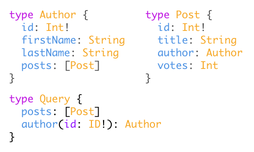
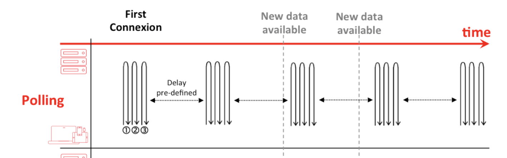
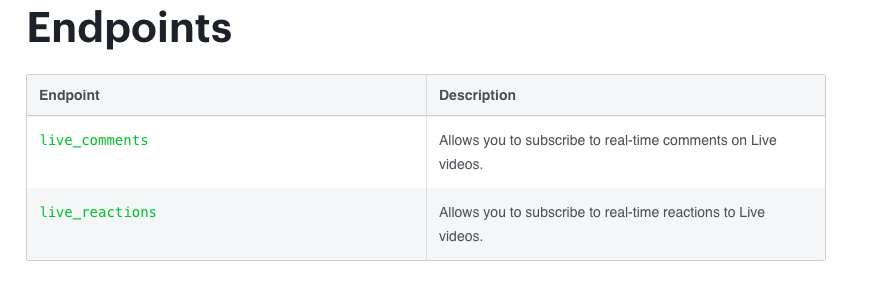

<!-- .slide: class="titulo" -->

# Tema 3: APIs web no RESTful

 <!-- .element: class="r-stretch" -->

---

## Contenidos

1. RPC
2. GraphQL
3. APIs orientados a eventos

---

<!-- .slide: class="titulo" -->

# 1. RPC

---

## APIs RPC

Abreviatura de **Remote Procedure Call**, son APIs modelados en torno a **operaciones** en lugar de **recursos**

```http
http://api-de-mentira.ua.es/buscarAlumno?dni=11222333
```


---

## ¿Qué pasa con el API de Flickr?

No es que sea un mal API, simplemente no es REST ¡¡en realidad es **RPC**!! ya que la interfaz es una lista de **operaciones** y no de **recursos**.   


---

## Otro ejemplo: el API Web de Slack

No sigue ningún estándar RPC, como [se dice en la documentación](https://api.slack.com/web#basics) simplemente es **"una colección de métodos HTTP al estilo RPC"**

- La URL siempre es de la forma `https://slack.com/api/METHOD_FAMILY.method`. Por ejemplo
  + `https://slack.com/api/channels.create`
  + `https://slack.com/api/conversations.invite`
  + `https://slack.com/api/conversations.archive`
- Usa únicamente GET y POST (por ejemplo borrar un mensaje se hace con POST)
- Según la operación se admiten los parámetros en formato `application/x-www-form-urlencoded` (o sea `nombre1=valor1&nombre2=valor2...`) o bien en JSON


Ejemplo: [documentación de cómo crear un canal](https://api.slack.com/methods/channels.create)

---

## Elecciones de diseño en un API RPC

- ¿Qué **protocolo** de transporte se usa?: HTTP, protocolos propios
- ¿Cómo se especifica la **operación**?: opciones
  - en la URL, 
  - en un parámetro HTTP
  - con un dato (JSON/XML/...) en el cuerpo de la petición
- ¿Cómo se pasan los **datos de entrada**?: opciones 
  - con parámetros HTTP
  - con datos (JSON/XML,...) en el cuerpo de la petición


---

## Estándares y protocolos abiertos en APIs RPC

- Estándares
    * [**JSON-RPC**](http://www.jsonrpc.org): JSON sobre HTTP
    * [**SOAP**](https://www.w3.org/TR/soap/)(*): XML sobre (generalmente) HTTP
- Abiertos
    * [**gRPC**](https://grpc.io)(*) (Google): datos binarios sobre HTTP/2
    * [**Apache Thrift**](https://thrift.apache.org)(*): JSON,XML,texto,binario sobre HTTP

(*) Hace transparentes las llamadas remotas

---

Algunos *frameworks* para desarrollar APIs RPC van un paso más allá y **hacen transparente la llamada remota**. En el código no hacemos peticiones HTTP sino en apariencia solo llamadas a **métodos/funciones**. Por ejemplo, [Apache Thrift](http://thrift.apache.org)

```javascript
var transport = new Thrift.TXHRTransport("http://localhost:8585/hello");
var protocol  = new Thrift.TJSONProtocol(transport);
var client = new HelloSvcClient(protocol);
//La llamada no parece remota!
var msg = client.hello_func();
```

<span class="caption">[HTML completo (ejemplo de cliente Thrift desde el navegador)](https://github.com/apache/thrift/blob/master/lib/nodejs/examples/hello.html)</span>

---

**RPC no es implícitamente inferior (ni superior) a REST**

- RPC puede resultar más intuitivo cuando un API se exprese mejor como un conjunto de operaciones/procesos más que de recursos
- REST es el estilo más popular (actualmente) en APIs web públicos

---

<!-- .slide: class="titulo" -->

# 2. APIs orientados a consultas: GraphQL

---

## Un problema importante de los APIs REST

La **granularidad** de los recursos es **fija**. En la petición no podemos indicar que queremos solo **parte del recurso** o que queremos también **recursos relacionados**


```http
http://miapirest.com/blogs/1/posts/1
```
<!-- .element class="caption" -->Queremos ver el post 1 del blog 1

El diseñador del API puede haber decidido que un post ya incluye los comentarios, o bien que no, pero es una *decisión fija*. Si a veces los necesitamos y otras no, tendremos un problema de eficiencia.

---

Ya vimos que ciertos APIs REST **extienden la sintaxis** para obtener solo algunos campos o para obtener recursos relacionados

```http
https://graph.facebook.com/JustinBieber?fields=id,name,picture
https://graph.facebook.com/me?fields=photos.limit(5),posts.limit(5)
```

- Un API orientado a consultas nos debería permitir hacer todas estas *queries* de una manera mucho más flexible.
- En la actualidad **GraphQL** es el representante más conocido de este tipo de APIs

---

## GraphQL vs REST

 <!-- .element class="stretch" -->

https://twitter.com/nikkitaftw/status/1011928066816462848 <!-- .element class="caption" -->


---

## ¿Qué es GraphQL?

Es un lenguaje para hacer consultas flexibles a **APIs orientados a recursos** en los que estos están relacionados entre sí formando un **grafo**


---

## Esquema GraphQL

Además del lenguaje de consulta hay una sintaxis para definir el **esquema** de los recursos (**estructura** del grafo + **consultas** posibles)



Esta sintaxis es "abstracta". La sintaxis real dependerá del lenguaje que estemos usando para implementar el servidor GraphQL


---

## Algunas cosas sobre GraphQL

- Desarrollado en Facebook y usado allí internamente desde 2012. [Dado a conocer](https://www.youtube.com/watch?v=9sc8Pyc51uU) en 2015
- La especificación es *open source*, aunque controlada por FB: [https://github.com/facebook/graphql](https://github.com/facebook/graphql)
- Hay [multitud de implementaciones](http://graphql.org/code/) de cliente y servidor en diferentes lenguajes
  

---

## Ejemplo sencillo

- Tomado de [https://github.com/kadirahq/graphql-blog-schema](https://github.com/kadirahq/graphql-blog-schema). Un API para gestionar un blog, sin BD, con datos en memoria para simplificar.
- [Esquema](https://github.com/kadirahq/graphql-blog-schema/blob/master/src/schema.js)
  * Recursos: `Post`, `Category`, `Author`, `Comment` 
  * Relaciones:  `Post->Category(1:1)`, `Post->Comment(1:N)`, `Post->Author(N:1)`, `Comment->Author(N:1)`

---

## Cómo probar el ejemplo

### En local

1. Clonar el [repositorio git](https://github.com/kadirahq/graphql-blog-schema)
2. Instalar dependencias con `npm install`
3. Arrancar el servidor GraphQL con `npm run start`
4. Abrir un navegador e ir a `http://localhost:3000`. Aparecerá [GraphiQL](https://github.com/graphql/graphiql), que es un editor interactivo y con autocompletado para lanzar consultas a APIs GraphQL

### Online

En [https://radiant-atoll-63982.herokuapp.com/](https://radiant-atoll-63982.herokuapp.com/)

---

Podéis probar estas consultas, u otras similares:

Podemos obtener los campos que queramos, del objeto sobre el que hacemos la *query* o de los relacionados

```javascript
query {
  latestPost {
    title
    author {
      name
    }
  }
}
```
Las *queries* pueden tener parámetros

```javascript
query {
  recentPosts(count:2) {
    title
    category 
  }
}
```

---

Ejemplo de mutación

```javascript
mutation {
  createAuthor(_id:"Pepito", name:"Pepito Pérez", twitterHandle:"@pepito") {
    # la mutación devuelve el autor creado, mostramos el nombre
    # (aunque es un poco tontería porque ya lo sabíamos :))
    name
  }
```

---

## El *schema*

Define la interfaz con el API: las **queries** (consultas), las **mutaciones** (modificaciones) y la **estructura de los datos**.

```javascript
const Schema = new GraphQLSchema({
  query: Query,
  mutation: Mutation
});

//aqui se definen las queries posibles y también la estructura
const Query = new GraphQLObjectType({
  name: 'BlogSchema',
  description: 'Root of the Blog Schema',
  fields: () => ({
    posts: {
      ...
    }
    latestPost: {
      ...
    }
    ...
  })
  ...
})
```
[Código completo](https://github.com/kadirahq/graphql-blog-schema/blob/master/src/schema.js)
<!-- .element class="caption" -->

---

## El *schema*

Define también la estructura de los datos

```javascript
const Author = new GraphQLObjectType({
  name: 'Author',
  description: 'Represent the type of an author of a blog post or a comment',
  fields: () => ({
    _id: {type: GraphQLString},
    name: {type: GraphQLString},
    twitterHandle: {type: GraphQLString}
  })
});
```


---

La *magia*, o el **"enganche" entre GraphQL y los datos reales** (típicamente en una BD, pero aquí simplemente en variables en memoria) se hace en la función **`resolve()`**

```javascript
latestPost: {
  type: Post,
  description: 'Latest post in the blog',
  resolve: function() {
    PostsList.sort((a, b) => {
      var bTime = new Date(b.date['$date']).getTime();
      var aTime = new Date(a.date['$date']).getTime();

      return bTime - aTime;
    });

    return PostsList[0];
  }
},
```

---

<!-- .slide: class="dim" -->
<!-- .slide: data-background-image="img_4/minions.jpg" -->
<!-- .slide: style="color: white; text-shadow: 1px 1px 3px black" -->
## Demo con el API GraphQL de Github

- [GraphQL Explorer](https://developer.github.com/v4/explorer/) (hace falta *estar logueado* en Github, todas las llamadas requieren autenticación)

- [Documentación](https://docs.github.com/en/free-pro-team@latest/graphql)

- [Otros APIs GraphQL de acceso público](https://github.com/apis-guru/graphql-apis)

---

## Más sobre GraphQL

- En un API REST hay una URL por recurso, aquí **todas las peticiones van a la misma URL**

```http
http://miservidorgraphql/api?query={...}
```

- Para los **errores no se usa el código de estado HTTP**, sino campos en el JSON de la respuesta

```javascript
#query incorrecta, ya que el campo "titulo" no existe
query {
  post(_id:"100") {
    titulo
  }
}

#respuesta del servidor
{
  "errors": [
    {
      "message": "Cannot query field \"titulo\" on type \"Post\"."
    }
  ]
}
```

---

GraphQL es una tecnología interesante, pero **tampoco tiene por qué ser un "REST *killer*"**

<iframe width="640" height="360" data-src="https://www.youtube.com/embed/cUIhcgtMvGc" frameborder="0" allowfullscreen></iframe>"</iframe>

[Por qué API REST está muerto y debemos usar APIs GraphQL - José María Rodríguez](https://youtu.be/cUIhcgtMvGc) (Independientemente del *clickbait* del título, una charla interesante y bien explicada, para ilustrar cómo funciona GraphQL y las diferencias con REST)
<!-- .element: class="caption" --> 

---

<!-- .slide: class="titulo" -->

# 3. APIs asíncronos / Orientados a eventos

---

Hay casos que no se adaptan bien al modelo **petición/respuesta** de REST
- Queremos estar al tanto de las **actualizaciones del servidor** (p. ej. un *juego online*, un *chat*, ver los *tweets* de nuestro *timeline*, ...)
- Hay **operaciones costosas** en tiempo o que no sabemos **cuándo van a acabar** ( p.ej. procesamiento de imágenes/video, generación de documentos (pdf, ...),  procesamiento de pagos, envío de *emails*, crear un *fork* en Github ...)
  

---

## REST "asíncrono"

Idea: 

- El cliente recibe una **respuesta HTTP síncrona** que confirma el **inicio** de la tarea, pero el procesamiento en sí se hace de forma asíncrona
- Para saber cúando ha terminado el procesamiento, el cliente debe hacer *polling*

 <!-- .element class="stretch" -->

---

## REST "asíncrono": posible implementación


1. Petición POST para solicitar procesamiento asíncrono

    - El servidor devuelve [202](https://developer.mozilla.org/es/docs/Web/HTTP/Status/202), (petición aceptada, pero trabajo no completado todavía)
    - En la cabecera `Content-Location` se devuelve la URL de la tarea que está procesando el recurso</li>
2. *polling* a intervalos regulares con GET a esta última URL
    - Si el procesamiento no ha terminado todavía se devuelve un 200 pero con un cuerpo de respuesta indicando “procesamiento pendiente”
    -Si ha terminado, se devuelve un 303 (la respuesta está en otra URL), enviando en la cabecera `Location` la URL del recurso generado

---

## Algunas tecnologías web para tiempo real/eventos

**de Servidor a Cliente(Navegador)**

- **Long polling**: el cliente hace *polling* pero la conexión se mantiene abierta hasta que el servidor envía datos. Entonces hay que hacer *polling* de nuevo
- **Server Sent Events**: el cliente recibe de forma asíncrona mensajes y eventos del servidor
- **Websockets**: comunicación bidireccional asíncrona basada en eventos
- **Notificaciones push**: el navegador recibe notificaciones que muestra automáticamente (las veremos en la parte de móviles)

**de Servidor a Servidor**

- **Webhooks**: se avisa con una petición HTTP cuando hay nuevos datos 


---


## Polling vs Long polling vs. SSE

De [Polling vs SSE vs WebSocket— How to choose the right one](https://codeburst.io/polling-vs-sse-vs-websocket-how-to-choose-the-right-one-1859e4e13bd9)
<!-- .element class="caption" --> 


---

## Server Sent Events


 + **Unidireccionales**, siempre desde el servidor al cliente
 + Mensajes de **texto** (NO datos binarios, ¿usar Base64?)
 + Funciona sobre **HTTP**
 + [Amplio soporte](https://caniuse.com/#feat=eventsource) en navegadores actuales

---

## Formato de los eventos

- El tipo MIME debe ser `text/event-stream`
- Cada evento es una línea que comienza por `data:`. Un evento puede ocupar varias líneas

```javascript
data: esto es un mensaje

data: este es otro, y tiene
data: dos líneas
```
- Se puede especificar un tipo de evento con una línea que comienza por `event:` y una etiqueta arbitraria 

```javascript
event: login
data: usuario533
```

---


## Ejemplo de SSE

Ejemplo completo en [https://glitch.com/edit/#!/peridot-coin](https://glitch.com/edit/#!/peridot-coin)
<!-- .element  class="caption"--> 

```javascript
//Servidor
app.get('/sse', function(pet, resp) {
  //El servidor de eventos debe usar el tipo MIME text/event-stream
  resp.header('Content-Type', 'text/event-stream')
  //Temporizador cada dos segundos
  setInterval(function() {
     //nombre del evento
     resp.write('event: ping\n')
     //datos del evento (texto, en nuestro caso un JSON)
     resp.write(`data: {"timestamp":"${new Date()}"}`)
     //Hay que acabar el mensaje con 2 retornos de carro
     resp.write('\n\n')
  }, 2000)
})

```

```javascript
//Cliente
var evtSource = new EventSource("/sse");
evtSource.addEventListener('ping', function(evento) {
   var datos = JSON.parse(evento.data)
   console.log(datos.timestamp)
})
```

---

Facebook ofrece algunos *endpoints* SSE en su "graph API"

[https://developers.facebook.com/docs/graph-api/server-sent-events](https://developers.facebook.com/docs/graph-api/server-sent-events)




---

## Websockets


+ **Bidireccionales**, tanto cliente como servidor pueden enviar mensajes
+ Los mensajes pueden contener **texto** o datos **binarios**
+ Usa un **protocolo propio** (no es HTTP). Podemos tener problemas para pasar algunos *firewalls* 

---

## Ejemplo de websockets

Ejemplo completo en [https://glitch.com/edit/#!/sugar-property](https://glitch.com/edit/#!/sugar-property)
<!-- .element  class="caption"--> 

```javascript
//SERVIDOR
var express = require('express');
var app = express();
app.use(express.static('public'));
var expressWs = require('express-ws')(app);

app.ws('/', function(ws, pet) {
  ws.on('message', function(data){
        console.log("Mensaje del cliente: " + data)
  })
  
  setInterval(
    () => ws.send(new Date().toLocaleTimeString()),
    2000
  )
}))
```

```javascript
//CLIENTE
var ws = new WebSocket('wss://' + window.location.hostname)
      
ws.onmessage = function(evento) {
 console.log("El servidor dice: " + evento.data)
}   

document.getElementById('botonMensaje').addEventListener('click', function() {
  ws.send(document.getElementById('mensaje').value)  
})
```

---

## Webhooks

- **Notificaciones entre servidores**, no de servidor a cliente
- Caso de uso típico: nuestros usuarios lo son también de un servicio de un tercero y queremos que ese tercero nos avise de actualizaciones
- Ante un evento al que estamos suscritos, el servidor del Webhook lanza una petición POST a una URL de nuestro servidor (*callback*)

<!-- .element: class="r-stretch" -->

---


## Ejemplos reales de webhooks

Algunos APIs REST públicos que usan *webhooks* y/o PubSubHubbub: Facebook, Instagram, Github, Paypal, Foursquare, algunos de Google (p.ej. Calendar), ... 
- Documentación y ejemplos
  - [Facebook real-time updates](https://developers.facebook.com/docs/graph-api/real-time-updates/)
  - [Github webhooks](http://developer.github.com/v3/repos/hooks/)


---

# ¿Alguna duda?
