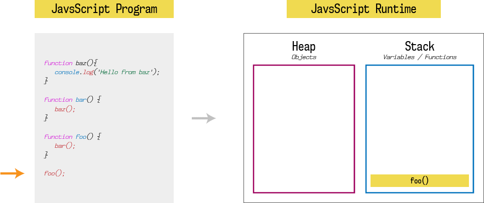
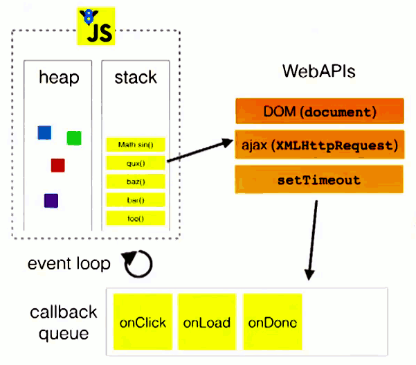
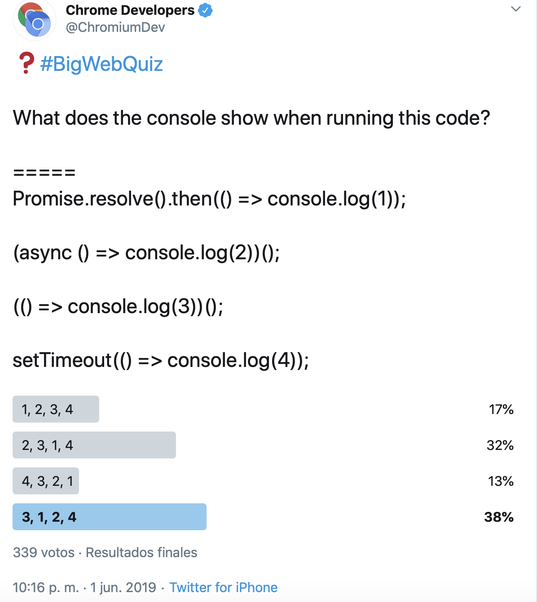

<!-- .slide: class="titulo" -->

# Tema 4: Javascript estándar en el cliente
## Parte 3: El *event loop* en Javascript

---

<!-- .slide: class="titulo" -->

# 1.
# Introducción


---

`setTimeout` nos permite ejecutar una función pasado un número de milisegundos, sería algo así como ejecutar una función tras un *delay*

```javascript
setTimeout(function() {
  console.log('hola')
}, 3000)
```

---

## WAT?

[https://jsbin.com/bibifan/edit?js,console](https://jsbin.com/bibifan/edit?js,console)<!-- .element class="caption" -->

```javascript
setTimeout(function(){
  console.log("Esto debería aparecer primero");
}, 0);
for(i=1;i<=1000;i++)
  console.log("Sorpresa!");
```


El [WAT](https://www.destroyallsoftware.com/talks/wat) original


---


> Javascript utiliza un modelo asíncrono y no bloqueante, con un *loop* de eventos implementado con un único *thread* para sus interfaces de entrada/salida

[https://lemoncode.net/lemoncode-blog/2018/1/29/javascript-asincrono](https://lemoncode.net/lemoncode-blog/2018/1/29/javascript-asincrono) <!-- .element class="caption"-->


---

## El *runtime* de Javascript

Los motores JS como V8 (Node, Chrome,...)/Spidermonkey(Firefox) implementan lo "más básico": el *heap* y el *stack*

 <!-- .element class="stretch"-->
[https://itnext.io/how-javascript-works-in-browser-and-node-ab7d0d09ac2f](https://itnext.io/how-javascript-works-in-browser-and-node-ab7d0d09ac2f) <!-- .element class="caption"-->

- El *loop de eventos* lo implementa el navegador o node


---

<!-- .slide: class="titulo" -->

# 2.
# El *loop* de eventos

---

1. Nuestro código llama a un API asíncrono externo o del navegador, que se ejecuta "fuera de nuestro código". Le pasamos un *callback* 
2. Al terminar la operación, hay que llamar al *callback*, esta tarea se coloca en una *cola de mensajes/eventos/tareas pendientes*
3. Cuando termina la tarea actual (el *call stack* está vacío), pasamos a la siguiente de la cola.

 
<!-- .element class="stretch"-->

[What the heck is the event loop anyway? / Philip Roberts / JSConf EU 2014](https://www.youtube.com/watch?v=8aGhZQkoFbQ)<!-- .element class="caption"-->


---

El *loop* de eventos no se procesa hasta que el *call stack* se queda vacío, lo que explica el ejemplo que vimos al principio

```javascript
setTimeout(function(){
  console.log("Esto debería aparecer primero");
}, 0);
console.log("Sorpresa!");
```

[JS Visualizer 9000](https://www.jsv9000.app/), una herramienta para visualizar el *event loop* ([este ejemplo](https://www.jsv9000.app/?code=c2V0VGltZW91dChmdW5jdGlvbigpewogIGNvbnNvbGUubG9nKCJFc3RvIGRlYmVy7WEgYXBhcmVjZXIgcHJpbWVybyIpOwp9LCAwKTsKY29uc29sZS5sb2coIlNvcnByZXNhISIpOw%3D%3D))

---

Os podéis imaginar el *loop* de eventos como "el bucle principal" del *runtime* (el navegador o node)

```javascript
while (true) {
    task = taskQueue.pop()
    execute(task)
}
```
[Further Adventures of the Event Loop - Erin Zimmer - JSConf EU 2018](https://www.youtube.com/watch?v=u1kqx6AenYw) <!-- .element class="caption" -->

- En la especificación se permite que haya más de una cola de tareas, por ejemplo Node usa una cola separada para los *timers*
- En navegadores, estamos ignorando otra cola de tareas que se ocupa del *rendering*

---

## Microtareas

- Típicamente asociadas a la resolución/rechazo de una promesa
- Se ejecutan inmediatamente después de la tarea actual, hasta que no terminan todas no se sigue con las "macro"tareas

```javascript
while (true) {
    task = queue.pop()
    execute(task)
    while(!microtaskQueue.empty()) {
        doMicrotask()
    }
}
```

---

 
<!-- .element class="stretch"-->
[https://jsbin.com/lexujo/edit?js,console](https://jsbin.com/lexujo/edit?js,console) <!-- .element class="caption"-->


---

<!-- .slide: class="titulo" -->
# 3.
# Rendering

---


- Además de ejecutar los *scripts* y las microtareas, los navegadores deben repintar la página si hemos hecho algún cambio en el HTML/CSS. Esto es parte del *event loop*, razón por la que si tardamos demasiado en algún *script* el navegador no podrá repintar nada.
- El repintado se hace a intervalos regulares a 60fps

```javascript
while (true) {
    task = queue.pop()
    execute(task)
    while(!microtaskQueue.empty()) {
        doMicrotask()
    }
    if (isRepaintTime())
        repaint()
}
```


---

el *event loop* es la razón por lo que código como este, que intenta hacer una "animación" en la que el texto va aumentando de tamaño progresivamente no funcionará

```javascript
var titulo = document.getElementById('titulo')
for(i=1;i<=100;i++){
  titulo.style.fontSize = i + 'px'
}  
```
[https://jsbin.com/helaqic/edit?html,js,output](https://jsbin.com/helaqic/edit?html,js,output)

¿Cómo lo arreglaríamos?

---

Posible solución:

```javascript
var titulo = document.getElementById('titulo')
function anim_frame(i) {
  titulo.style.fontSize = i + 'px'
  if (i<100)
    setTimeout(anim_frame, 100, i+1)  
}

setTimeout(anim_frame,100, 1)
```

---

`setInterval(callback, ms)` fija un temporizador cada x milisegundos que se ejecutará hasta que se pare con `clearInterval`

```javascript
var titulo = document.getElementById('titulo')
var timer
var tam = 1
function anim_frame() {
   if (tam<150) {
      tam = tam + 1
      titulo.style.fontSize = parseInt(tam) + 'px'
   }
   else
      clearInterval(timer)
}
timer = setInterval(anim_frame,50)
```

---

## requestAnimationFrame

Función especializada para las animaciones que nos asegura una sincronización precisa a 60FPS (ejemplo de [`setTimeout` vs `requestAnimationFrame`](https://codepen.io/klugjo/pen/zBYLOX)
)

Desde dentro del *callback* de `requestAnimationFrame` hay que llamar a `requestAnimationFrame` igual que hacíamos con el `setTimeout`

```javascript
var titulo = document.getElementById('titulo')
var tam = 1
function anim_frame() {
   if (tam<150) {
      tam = tam + 1
      titulo.style.fontSize = tam + 'px'
      requestAnimationFrame(anim_frame)
   }
}
anim_frame()
```
[https://jsbin.com/vusekop/edit?html,js,output](https://jsbin.com/vusekop/edit?html,js,output) <!-- .element class="caption"-->

---

## Referencias

- 📖 [Javascript Asíncrono: La guía definitiva](https://lemoncode.net/lemoncode-blog/2018/1/29/javascript-asincrono)
- 📖 [Javascript.info: The event loop](https://javascript.info/event-loop#event-loop)
- 📺 [What the heck is the event loop anyway? / Philip Roberts / JSConf EU 2014](https://www.youtube.com/watch?v=8aGhZQkoFbQ)
- 📺 [Further Adventures of the Event Loop / Erin Zimmer / JSConf EU 2018](https://www.youtube.com/watch?v=u1kqx6AenYw)
