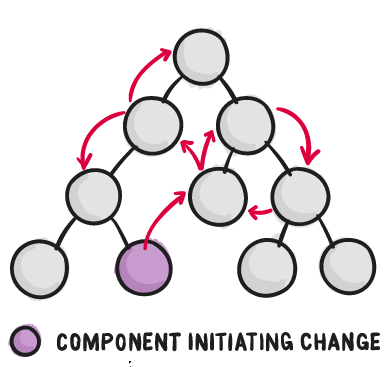
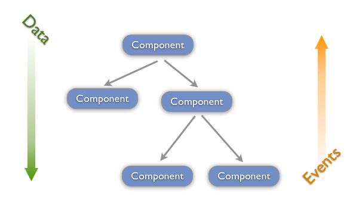
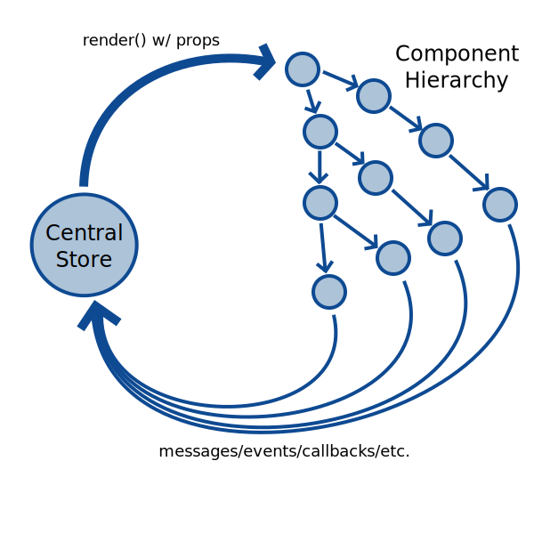
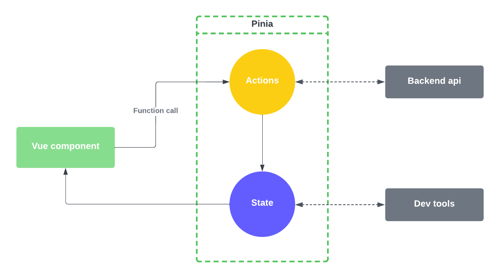
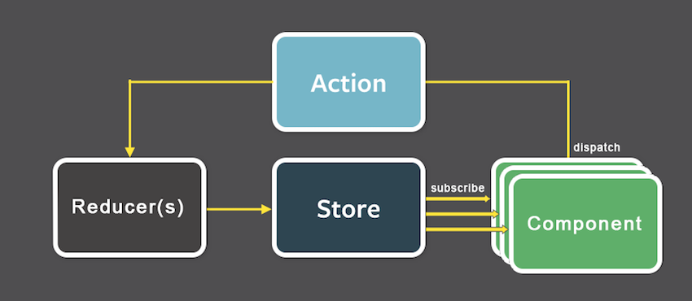

<!-- .slide: class="titulo" -->

# Tema 3: Frameworks JS en el cliente 
## parte III: Gestión del estado


---
<!-- .slide: class="titulo" -->

# 1. Introducción. El estado de una *app*

---

## ¿Qué es el estado de una *app* en *frontend*?

- Datos que muestra la *app* y que vienen del servidor
- Datos que ha introducido el usuario y que habrá que sincronizar con el servidor
- Información global de la app como el usuario autentificado, las preferencias, ...

---

> "Como los requisitos en aplicaciones JavaScript de una sola página se están volviendo cada vez más complicados, nuestro código, mas que nunca, debe manejar el estado. **Este estado puede incluir respuestas del servidor y datos cacheados, así como datos creados localmente que todavía no fueron guardados en el servidor. El estado de las UI también se volvió más complejo**, al necesitar mantener la ruta activa, el tab seleccionado, si mostrar o no un spinner...

> **Controlar ese cambiante estado es difícil**. Si un modelo puede actualizar otro modelo, entonces una vista puede actualizar un modelo, el cual actualiza otro modelo, y esto causa que otra vista se actualice. **En cierto punto, ya no se entiende que esta pasando en la aplicación ya que perdiste control sobre el cuándo, el por qué y el cómo de su estado**. 

De la documentación de Redux: ["Motivación"](http://es.redux.js.org/docs/introduccion/motivacion.html) 

---


<blockquote class="twitter-tweet"><p lang="en" dir="ltr">If you don&#39;t think managing state is tricky, consider the fact that 80% of all problems in all complex systems are fixed by rebooting.</p>&mdash; stuarthalloway (@stuarthalloway) <a href="https://twitter.com/stuarthalloway/status/1134806008528809985?ref_src=twsrc%5Etfw">June 1, 2019</a></blockquote> <script async src="https://platform.twitter.com/widgets.js" charset="utf-8"></script>

---

<!-- .slide: class="titulo" -->

## 2. Estado local/distribuido

---

Recordemos que las aplicaciones Vue, React, Angular... están formadas de **componentes organizados jerárquicamente**


---

- Una idea *natural* es que **cada componente almacene localmente su estado**

```javascript
aapp.component('item',{
    props:["nombre","comprado","id"],
    data()  {
      return {estado:this.comprado}
    },
    methods: {
      cambiarEstado() {
          this.estado = !this.estado
      }
    },
    template: `
      <li :class="estado ? 'tachado' : '' "
          @click="cambiarEstado">
        {{nombre}}
      </li>  
    `
})
```

- Para algunas funcionalidades necesitaremos **pasar estado entre componentes**: ejemplo:
  +  mostrar items ordenados por diferentes criterios (nombre, comprado o no,...)
  +  Mostrar una cuenta de las cosas que quedan por comprar

---

Queremos reducir/organizar al máximo el paso de datos entre componentes, para evitar un  flujo de datos complicado

 <!-- .element class="stretch" -->


1. Reducir el número de componentes con estado
2. Mantener un flujo unidireccional de la información
3. Estandarizar comunicación entre componentes no relacionados


---

## 1. Reducir el número de componentes con estado

>  Práctica recomendada: almacenar el **estado** solo en el componente de **nivel superior**

Beneficio: si un componente no tiene estado podemos considerar la vista como una **función pura de sus `props`**.

Simplifica el *testing* y el razonamiento sobre el componente 

---

## 2. Mantener un **flujo unidireccional** de información

- Si cambia el estado: comunicación de "padres" a "hijos" con las *props*
- Si hay que cambiarlo : de "hijos" a "padres" mediante eventos

 <!-- .element class="stretch"  -->

Más fácil seguir la pista de los cambios si hay algún *bug*

---

## Provide/Inject en Vue

- Permite [compartir datos de un componente a sus descendientes](https://vuejs.org/guide/components/provide-inject.html)


<!-- .element class="column half" -->
```javascript
app.component(`Root`,{
  ...
  provide: {mensaje:"Hey!"},
  ...
})
``` 


<!-- .element class="column half" -->
```javascript
app.component(`DeepChild`,{
  ...
  inject: ["mensaje"],
  ...
})

```
- En otros *frameworks* existen funcionalidades similares, por ejemplo **Context** en React


---

## 3. Organizar la comunicación entre componentes no relacionados

Posibilidad: **event bus**

- Es simplemente un objeto global que permite **publicar eventos y suscribirse a ellos**. Los eventos serán los mensajes entre componentes.
- En Javascript este patrón suele llamarse *event bus* o *event emitter*. Hay multitud de librerías que implementan esta idea

---

## Event Bus en Vue

Tenemos que usar alguna librería externa (aquí usamos [mitt]())

```javascript
//Esto debería ser global a todos los componentes
import mitt from "mitt"
const emitter = mitt()

//para emitir un evento:
emitter.emit("nombre-evento", {dato1:"hola", dato2:1})

//para suscribirse a un evento:
emitter.on("nombre-evento", function(payload) { console.log(payload.dato1)})
```


[Ejemplo completo](https://codesandbox.io/s/event-bus-mitt-vue3-zoyhk)

---

Por desgracia, el *event bus* rompe la idea de *flujo unidireccional*. 

**¿Cómo podemos seguir manteniendo un flujo unidireccional de información en toda la aplicación?**


---

<!-- .slide: class="titulo" -->

## 2. Estado centralizado. El patrón *Store*

---

Idea: ¿por qué no sacamos el estado fuera de todos los componentes y nos lo llevamos a un "almacén centralizado"?

<!-- .element: class="stretch" --> 


De ese modo **todos los componentes** se convertirían en funcionales

---

## El "patrón" *store*

<div class="wrapper texto_figura">
<div>

- _store_: almacén centralizado con el estado de la _app_
- Los componentes **no modifican directamente** el estado, las modificaciones se hacen siempre a través de **métodos del *store*** 

```javascript
var store = {
  state: reactive({
    message: 'Hello!'
  }),
  setMessage (newValue) {
    this.state.message = newValue
  },
  clearMessage () {
    this.state.message = ''
  }
}
```
[Ejemplo completo](https://jsbin.com/yumuzotari/edit?html,js,console,output)
</div>

<div>
 
</div>
</div>

---

<!-- .slide: class="titulo" -->

## 3. Estado centralizado en Vue: Pinia/Vuex


---

**Pinia/Vuex 5** es el *framework* "oficial" de Vue para la gestión centralizada del estado. Es una implementación del "patrón *store*" (algo más sofisticada que lo que vimos antes)

Aunque es particular de Vue se basa en los mismos principios básicos que se aplican habitualmente en el resto de *frameworks* Javascript: React (Redux), Angular (NgRedux), Svelte (Stores), ...


---

## Antecedentes de Pinia

- **[La arquitectura Elm](https://guide.elm-lang.org/architecture/)** (2012): Elm es un lenguaje específico para clientes web que transpila a JS
- **[Flux](https://facebook.github.io/flux/)** (2014): arquitectura propuesta por Facebook  para estructurar aplicaciones con su framework React
- **[Redux](https://es.redux.js.org/)** (2015): la variante de Flux de mayor éxito, normalmente usada en React pero portada luego a frameworks como Angular o Vue
- Versiones anteriores de **[Vuex](https://vuex.vuejs.org/)**

---

## El patrón *store* básico en Pinia

- El *store* es un objeto que contiene las propiedades 
  + `state`: el "árbol global" con el estado de la *app*
  + `getters`: variables calculadas en función del estado
  + `actions`: métodos para modificar el estado 

```javascript
import { defineStore } from "pinia";

export const useCounterStore = defineStore("contador", {
  state: () => ({ valor: 0 }),
  getters: {
    valorDoble: (state) => state.valor * 2
  },
  actions: {
    increment() {
      this.valor++;
    }
  }
});

```

---

## Componente que usa el *store*

- Tiene una propiedad calculada (_computed_) a partir del _state_ del _store_. Al ser éstas reactivas, **un cambio en el _store_ desencadena un repintado** del componente.
- Llamamos a una *action* sobre el *store* para cambiar el estado

```javascript
<template>
  <h1>{{ valor }}</h1>
  <button @click="increment">Incrementar con setup</button>
</template>

<script>
import { useCounterStore } from "../store.js";

export default {
  name: "ContadorSetup",
  setup() {
    const counterStore = useCounterStore();
    return { counterStore };
  },
  computed: {
    valor() {
      return this.counterStore.valor;
    },
  },
  methods: {
    increment() {
      this.counterStore.increment();
    },
  },
};
</script>


```

---

Aclaración: en la transparencia anterior se usa el método `setup` que en realidad es parte del "Composition API", no del "Options API" que es el que nosotros usamos en Vue. Se puede usar Pinia con el "Options API puro" como se explica en [la documentación](https://pinia.vuejs.org/cookbook/options-api.html), aunque el código es más complicado.

---

## Código de ejemplo

- [Ejemplo completo del contador en CodeSandbox](https://codesandbox.io/s/contador-pinia-8gplz8)
- [Lista de la compra en Github](https://github.com/ottocol/lista-compra-vue-pinia)


---

## Flujo unidireccional en Pinia





---

## Pinia vs. Redux

 <!-- .element: class="column half" -->
 <!-- .element: class="column half" -->


---

Para **aplicaciones pequeñas, Pinia/Redux/NgRedux... no son necesarios**

> **People often choose Redux before they need it**. “What if our app doesn’t scale without it?” **Later, developers frown at the indirection Redux introduced to their code**. “Why do I have to touch three files to get a simple feature working?” Why indeed!
People blame Redux, React, functional programming, immutability, and many other things for their woes, and I understand them. It is natural to compare Redux to an approach that doesn’t require “boilerplate” code to update the state, and to conclude that Redux is just complicated

<!-- .element: class="caption" --> 
  Dan Abramov, [You Might Not Need Redux](https://medium.com/@dan_abramov/you-might-not-need-redux-be46360cf367)"

---


## Time travel debugging


Si hacemos un *log* de los cambios de estado, avanzando y retrocediendo por él podemos **reproducir el estado de la aplicación en cualquier momento**

<!-- .element: class="stretch" -->
